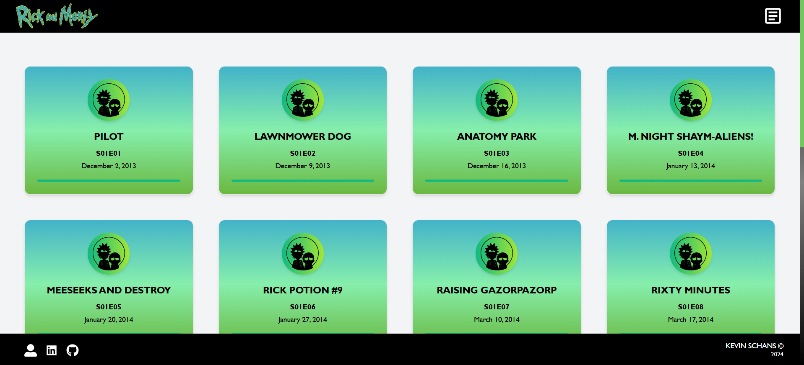

# Rick & Morty App

## NextJS / ReactTS / Redux / TailwindCSS

<br>

<div align="center">
  
</div>

<br>

<div>

    Rick & Morty App: Discover every episode of the series and explore its most fascinating
    details, including air dates and unique codes. Plus, meet the characters who made history
    and dive into the captivating multiverse of Rick & Morty.

    The design of its architecture follows the principles of Clean Architecture and Screaming
    Architecture, ensuring a clear separation of responsibilities, modularity and scalability.

</div>

<br>

---

# Index

- [Rick \& Morty App](#rick--morty-app)
  - [NextJS / ReactTS / Redux / TailwindCSS](#nextjs--reactts--redux--tailwindcss)
- [Index](#index)
  - [**DEPLOY**](#deploy)
  - [Project Setup](#project-setup)
    - [Prerequisites](#prerequisites)
    - [Clone the repository](#clone-the-repository)
    - [.env.local file](#envlocal-file)
    - [Install dependencies](#install-dependencies)
    - [Run the development server](#run-the-development-server)
    - [Access the application](#access-the-application)
    - [Other scripts](#other-scripts)
    - [Learn More](#learn-more)
  - [Architecture and Design Patterns Used](#architecture-and-design-patterns-used)
    - [Dependency Inversion Principle (DIP)](#dependency-inversion-principle-dip)
    - [Layered Architecture (Layered Pattern)](#layered-architecture-layered-pattern)
    - [Repository Pattern](#repository-pattern)
    - [Screaming Architecture](#screaming-architecture)
    - [Entity Pattern](#entity-pattern)
    - [Presentation Component Pattern and Containers](#presentation-component-pattern-and-containers)
    - [Centralized Error Handling Standard](#centralized-error-handling-standard)
  - [Domain Model](#domain-model)
    - [Key Entities](#key-entities)
    - [Design Rationale](#design-rationale)
  - [Project Routes](#project-routes)
    - [Front-end Routes](#front-end-routes)
    - [API Routes](#api-routes)
  - [Clean Code Principles Followed](#clean-code-principles-followed)
  - [Lighthouse results](#lighthouse-results)
  - [Features](#features)
  - [Technologies and Tools used](#technologies-and-tools-used)
  - [Contribution](#contribution)
  - [Project Status](#project-status)
  - [Project Developer](#project-developer)

<br>

### **DEPLOY**

<div align="center">
  <a href="https://rick-and-morty-nextjs-react.vercel.app" target="_blank">
    
  </a>
</div>

<br>

## Project Setup

These are the instructions to setup and run the project in your local environment.

### Prerequisites

Before running this project locally, ensure that you have the following tools installed:

- **Node.js** <br> Version 16.x or higher (required for running Next.js). <br> You can download and install Node.js from
  [here](https://nodejs.org/). <br> Make sure you're using a version compatible with the project's dependencies
  (>=16.x).

- **npm** or **yarn** <br> Package managers to install dependencies. <br> Either **npm** (comes with Node.js) or
  **yarn**. Install **yarn** (if preferred) by running: `npm install --global yarn`

- **Git** <br> For cloning the repository. <br> Version control tool to clone the repository. Install from
  [here](https://git-scm.com/).

### Clone the repository

Clone the repository to your local machine using the following command:

```sh
  git clone https://github.com/KevinVanDerSchans/rick-and-morty-nextjs.git
```

### .env.local file

Make sure to create a .env.local file in the project root for the necessary environment variables.

### Install dependencies

Install the project dependencies using the following command:

```sh
  npm install
```

### Run the development server

Run the development server to verify everything is working correctly:

```sh
  npm run dev
```

### Access the application

Open your browser and navigate to http://localhost:3000/ to see the application running.

<br>

### Other scripts

Compile and Minify for Production:

```sh
  npm run build
```

Lint with [ESLint](https://eslint.org/):

```sh
  npm run lint
```

### Learn More

To learn more about Next.js, take a look at the following resources:

- [Next.js Documentation](https://nextjs.org/docs) - learn about Next.js features and API.
- [Learn Next.js](https://nextjs.org/learn) - an interactive Next.js tutorial.

<br>

## Architecture and Design Patterns Used

### Dependency Inversion Principle (DIP)

This **Clean Architecture** principle allows high-level modules to remain independent of the details of low-level
modules by reversing dependencies. I implemented this to keep the core business logic isolated from external frameworks
or UI layers, ensuring scalability and easy maintenance.

In this project, I used `repositories` to keep the **domain logic isolated from external services** such as data
persistence or third-party APIs. This ensures that changes in external systems do not affect the core logic, making the
system more scalable and maintainable.

### Layered Architecture (Layered Pattern)

Clean Architecture promotes the **separation of responsibilities** across multiple layers (such as `domain`, `app`,
`infrastructure`, and `presentation`). By using this pattern, I ensured that changes in one layer do not affect others,
following principles such as the **Open-Closed Principle (OCP)**.

### Repository Pattern

I implemented this pattern to **abstract the data access layer from the business logic**. It centralizes data access and
ensures that the domain logic is not affected by persistence details. This allows for a clear separation of
responsibilities and more flexible, maintainable code.

For example, `EpisodesRepository` enables switching between different data sources (such as APIs or databases) without
affecting the core domain logic, ensuring easy extensibility.

### Screaming Architecture

Following the principles of **Screaming Architecture**, the project structure was organized so that the core business
logic and domain model "shout out" what the application does. Each feature, such as `episodes` or `characters`, is
encapsulated in its own directory, containing all related components, services, repositories and state management.

This organization highlights the system's purpose and functionality, making the codebase more intuitive and maintainable
by reducing technical clutter.

### Entity Pattern

In this project, we have two entities: `Episode` and `Character`. This pattern represents **key domain data**,
encapsulating properties and ensuring that the domain remains separate from concerns like UI and external data.

This follows the principle of **separation of responsibilities** in Clean Architecture.

### Presentation Component Pattern and Containers

I used this pattern to clearly **separate business logic from presentation logic**, which improves maintainability and
code reusability. Presentational components (e.g., `EpisodeCard.tsx`) focus exclusively on the UI and visual
representation, while containers (e.g., custom hooks like `useFetchEpisodes.ts` or `useFetchCharacters.ts`) handle the
business logic, state and interactions with external APIs or services.

### Centralized Error Handling Standard

I centralized error handling through a dedicated `ErrorService` module, ensuring that the system **handles errors
consistently across all layers**. This module captures errors from various failure points (e.g., API failures or
business logic exceptions), logs them for monitoring and **returns user-friendly messages to the UI**. This provides a
uniform approach to error handling, improving maintainability and debuggability.

<br>

## Domain Model

The domain model of this application is designed to represent the core entities relevant to the system's business logic.
The entities are `Episode` and `Character`; each encapsulating specific attributes that align with the business needs of
the application. This design ensures that the domain logic remains isolated from other concerns, such as UI or data
persistence.

### Key Entities

| Entity        | Description                                          |
| ------------- | ---------------------------------------------------- |
| **Episode**   | Represents an episode of the Rick & Morty series.    |
| **Character** | Represents a character from the Rick & Morty series. |

- **Episode**: Each `Episode` contains the following attributes:

  - `id`: A unique identifier for the episode.
  - `name`: The full name of the episode.
  - `air_date`: The first air date of the episode.
  - `episode`: The episode code, indicating the season and episode number (e.g., "S01E01").
  - `characters`: An array of URLs pointing to the characters that appeared in the episode.
  - `url` (optional): The URL of the episode resource in the API.
  - `created` (optional): The timestamp indicating when the episode data was added to the API.

- **Character**: Each `Character` contains the following attributes:

  - `id`: A unique identifier for the character.
  - `name`: The full name of the character.
  - `status`: The current status of the character (e.g., "Alive", "Dead", "unknown").
  - `species`: The species to which the character belongs (e.g., "Human", "Alien").
  - `type`: Additional descriptive information about the character's type (e.g., "Gromflomite").
  - `gender`: The gender of the character (e.g., "Male", "Female", "unknown").
  - `origin`: An object containing:
    - `name`: The name of the character's origin location.
    - `url`: A URL pointing to the details of the origin location.
  - `location`: An object containing:
    - `name`: The name of the character's current location.
    - `url`: A URL pointing to the details of the current location.
  - `image`: A URL pointing to the character's image.
  - `episode`: An array of URLs pointing to the episodes in which the character appeared.
  - `url`: The URL of the character resource in the API.
  - `created`: A timestamp indicating when the character data was added to the API.

### Design Rationale

This domain model was designed to maintain separation between the core business logic and external layers. The use of
interfaces and type safety (via **_TypeScript_**) ensures that the structure of these entities remains robust and
flexible. By encapsulating attributes and defining relationships clearly, the model remains adaptable to future changes
in business requirements without affecting other layers of the application.

This approach aligns with the principles of **Clean Architecture**, keeping the domain layer decoupled from any
infrastructure or presentation concerns, ensuring that changes in external systems (e.g., APIs or databases) do not
impact the business logic.

<br>

## Project Routes

### Front-end Routes

| Route            | Description                                                                                                       |
| ---------------- | ----------------------------------------------------------------------------------------------------------------- |
| `/`              | Landing page.                                                                                                     |
| `/episodes/[id]` | Dynamic page where you can view the details of the episode, the list of associated characters and a comment form. |
| `/404 `          | Error page displayed when a route is not found.                                                                   |

### API Routes

| Route                                          | Description                        |
| ---------------------------------------------- | ---------------------------------- |
| `https://rickandmortyapi.com/api/episode`      | Obtains a list of episodes.        |
| `https://rickandmortyapi.com/api/episode/[id]` | Obtains the details of an episode. |

<br>

## Clean Code Principles Followed

In this project, I have adhered to several core Clean Code principles to ensure readability, maintainability and
scalability. These principles guide the overall structure and help maintain a codebase that is easy to extend and
understand:

<div>

    SRP (Single Responsibility Principle)

    DRY (Don’t Repeat Yourself)

    KISS (Keep It Simple, Stupid)

    YAGNI (You Aren’t Gonna Need It)

</div>

<br>

## Lighthouse results

<div align="center">
  
</div>

<br>

## Features

<div>

    ✔️ Data visualization through key entities: Episodes and Characters

    ✔️ Comment Form with a fake endpoint

    ✔️ Error handling service with custom errors for precise issue detection

    ✔️ Dynamic user feedback with SweetAlert2

    ✔️ Fully responsive design, optimized for accessibility and SEO performance

</div>

<br>

## Technologies and Tools used

<div align="center">
  <br>
    <a href="https://nextjs.org/" target="_blank" rel="noreferrer"> </a>
    <a href="https://es.react.dev/" target="_blank" rel="noreferrer"> </a>
    <a href="https://redux.js.org/" target="_blank" rel="noreferrer"> </a>
    <br>
    <br>
    <a href="https://www.typescriptlang.org/" target="_blank" rel="noreferrer"> </a>
    <a href="https://tailwindcss.com/" target="_blank" rel="noreferrer"> </a>
    <br>
    <br>
  <br>
</div>

<br>

## Contribution

If you want to contribute to this project, follow these steps:

1. Perform a fork to the repository.

2. Create a branch for your feature or bugfix: `git checkout -b feature/your-feature-name`

3. Make the necessary changes and commits: `git commit -m 'Add some feature'`

4. Push to branch: `git push origin feature/your-feature-name`

5. Send a pull request to the original repository.

<br>

## Project Status


<br>

## Project Developer

| [<br><sub>Kevin Schans</sub>](https://github.com/KevinVanDerSchans) |
| :--------------------------------------------------------------------------------------------------------------------------------------------: |
